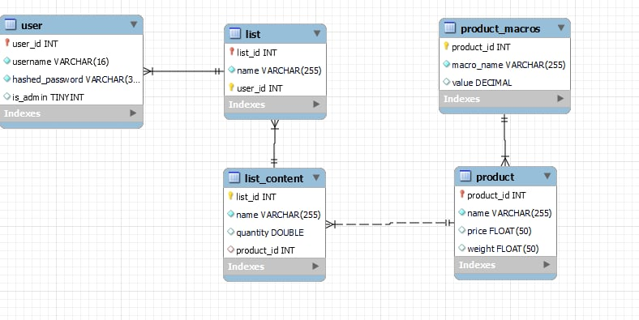

# Shopping List
## Project Description 

Project allows the user to browse shopping list. User can add products to shopping lists.
The user can filter available products.
Administrator can add products to the list of available products.

## Requirements

1. Clone GitHub repository
2. Download <a href="https://dotnet.microsoft.com/en-us/download/dotnet/8.0">.NET 7.0</a> or later
3. Install following packages on your computer:
   ```diff
            Microsoft.AspNetCore.Identity.EntityFrameworkCore, 
            Microsoft.EntityFrameworkCore.Design, 
            Microsoft.EntityFrameworkCore.SQLite, 
            Microsoft.EntityFrameworkCore.SqlServer, 
            Microsoft.EntityFrameworkCore.Tools, 
            Microsoft.VisualStudio.Web.CodeGeneration.Design.
   ```
4. Update database with following terminal command:
   <code>dotnet ef database update</code>
5. Start the app by typing:
   <code>dotnet run</code>

## Technologies

<div>
	
	
</div>

## Database


